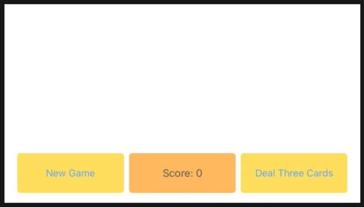
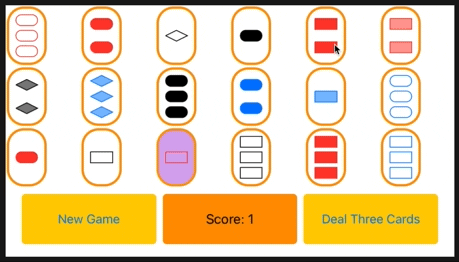

# Assignment 3: Set Game

*The course code is Xcode11 based, this code is adjusted to Xcode12*

## Required Tasks:
https://cs193p.sites.stanford.edu/sites/g/files/sbiybj16636/files/media/file/assignment_3.pdf

## Result
* NewGame and Deal3cards:  
   
* Matched and UnMatched:  
   
* After Deal Three Cards Disabled:  
   
