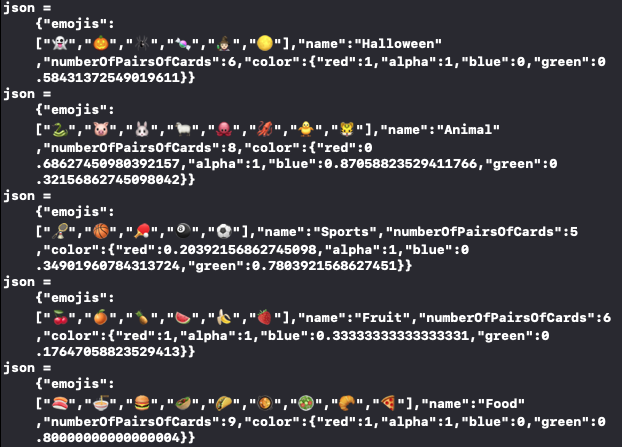

# Assignment 5: JSON Memorize Theme

https://cs193p.sites.stanford.edu/sites/g/files/sbiybj16636/files/media/file/assignment_5.pdf

## Required Task #1
Remove the “random number of  cards” theme option from your Memorize game.  
Each theme will now have its own specific, pre-defined number of  cards.  
In other words, how many cards are in a game is part of  the theme for that game and it can no longer be “random”. 

### Solution
Change to emojis.count

Note:
If I define as below (computed var), it will show correctly, but it won't be shown in JSON.

`var numberOfPairsOfCards: Int {
    emoji.count
}`

If I initiate it in `init`, then it shows in JSON.

## Required Task #2
Every time a new game starts, print a JSON representation of the theme being used for that game out to the console. 
All elements of the theme (its name, the emojis to choose from, how many pairs of  cards to show and the color of  the theme) must be included. 

### Solution
The hint is to store RGBA CGFloat value struct, thus I implemented accordingly with reference of 
https://developer.apple.com/design/human-interface-guidelines/ios/visual-design/color/#system-colors

However, due to Apple has different RGBA to different Light/Dark and Accessibility. 
I personally prefer to use use colorName: String and store string-Color dictionary for it.

## Result

