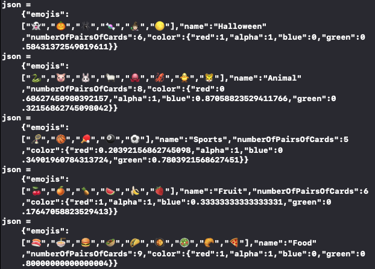

# Assignment 6: Memorize Themes

https://cs193p.sites.stanford.edu/sites/g/files/sbiybj16636/files/media/file/assignment_6.pdf

## Required Tasks

1. Your Memorize application should now show a “theme chooser” UI when it launches.  See attached images for examples, but you can be creative with how you show each theme. 

2. Use a List to display the themes.

3. Each row in the List shows the name of  the theme, the color of  the theme, how many cards in the theme and some sampling of  the emoji in the theme.

4. Touching on a theme in the List navigates (i.e. the List is in a NavigationView) to playing a game with that theme. 

5. While playing a game, the name of  the theme should be on screen somewhere and you should also continue to support existing functionality like score, new game, etc. (but you may rearrange the UI if  you wish). 

6. It is okay if  going from playing a game back to the chooser and then back to the game in progress restarts the game, though savvy implementations would probably not do that (except when the theme in question is modified (see below) since that would almost certainly want to restart the game). 

7. Provide some UI to add a new theme to the List in your chooser. 

8. The chooser must support an Edit Mode where you can delete themes and where you can access some UI (i.e. a button or image in each row) which will bring up a Theme Editor UI for that theme modally (i.e. via sheet or popover). 

### Solution
Due to it is only allowed one sheet/popover over one view, this popover need to be outside of foreach and also passing "selectedTheme" instead of "$showingThemeEditor", so it passes theme info correctly.

9. The Theme Editor must use a Form. 

10. In the Theme Editor, allow the user to edit the name of  the theme, to add emoji to the theme, to remove emoji from the theme and to specify how many cards are in the theme.  (It is Extra Credit to be able to edit the color of  the theme.) 

11. The themes must be persistent (i.e. relaunching your app should not cause all the theme editing you’ve done to be lost). 

12. Your UI should work and look nice on both iPhone and iPad. 

13. Get your application work on a physical iOS device of  your choice.

## Result

