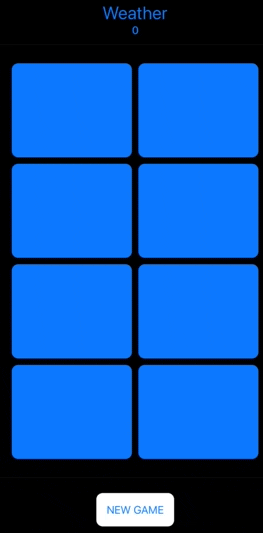
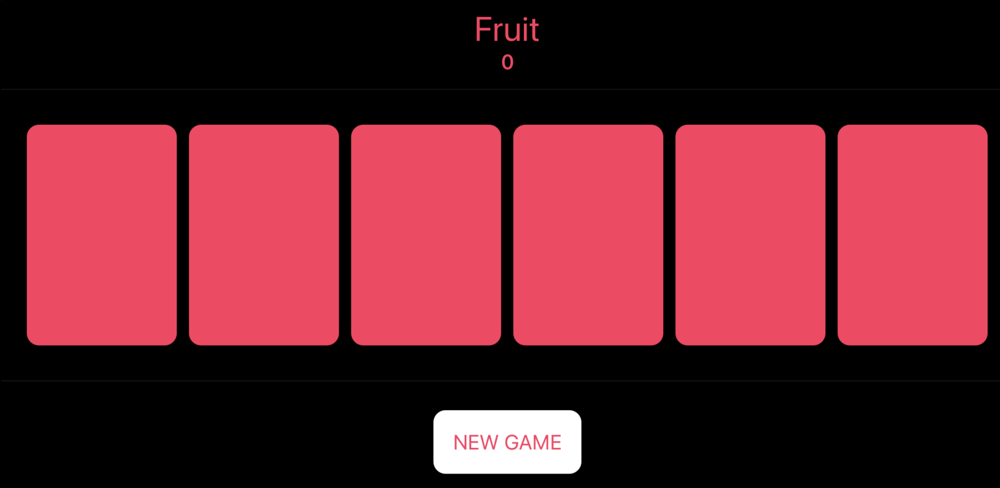

# Assignment 2: More Memorize 

*The course code is Xcode11 based, this code is adjusted to Xcode12*

## [Required Tasks](https://cs193p.sites.stanford.edu/sites/g/files/sbiybj16636/files/media/file/a2_0.pdf):
1. Lecture 1 - 4
2. Shuffle cards
3. Add Theme, including name, set of emoji, number of cards to show, color
4. Support 6 Themes
5. Add a new theme in one line code
6. Add "New Game" button, start a game with random chosen theme 
7. Keep score in your game by giving 2 points for every match and penalizing 1 point for every previously seen card that is involved in a mismatch.
8. Display Score
9. Look good in Landscape

## Result

 
 

